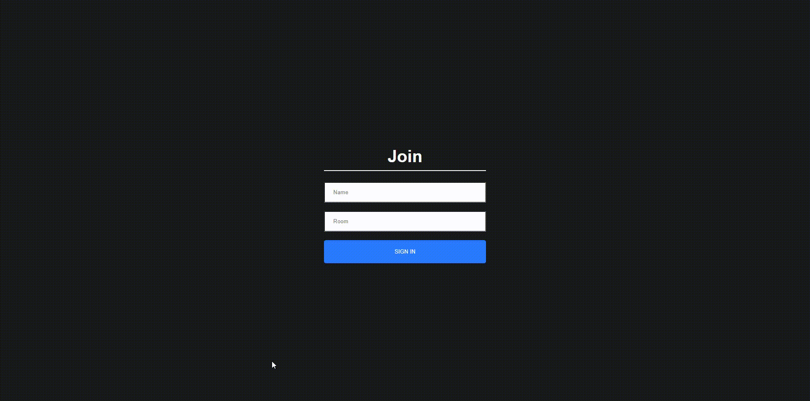

# CHAT-App-Socket-Node-React
Chat Application made using Node js , Socket io , React js (live)



## This code is a basic chat app based on Javascript Mastery's video , learnt a lot about socekets and node .
This Code is beginner friendly!

### How to run the code?
```
git clone or download

npm i && npm start for both client and server to start the app

```
#### Features to add

* Better UI
* Error Handling
* Trying with different Packages
